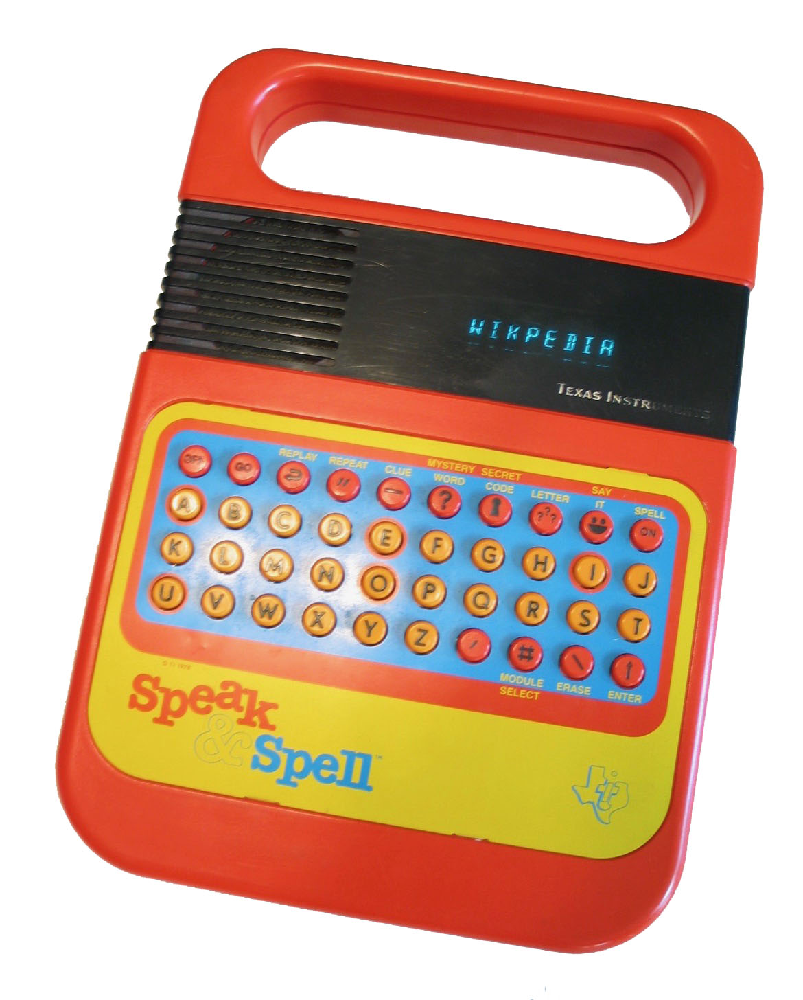
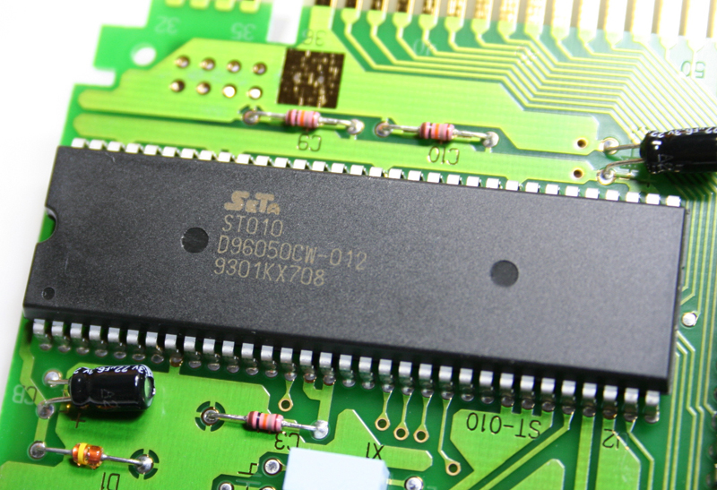
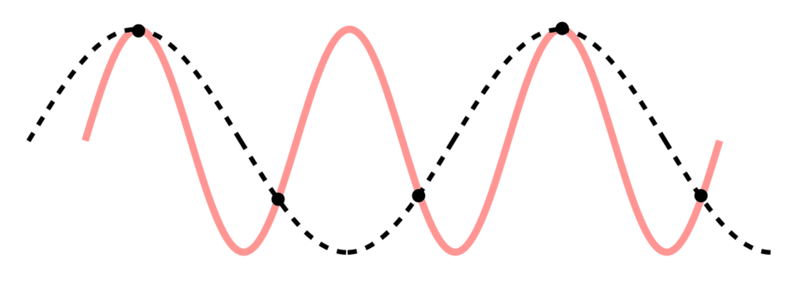

<!--
version: 0.18b

author: Fabian Bartl
email: fabian@informatic-freak.de

title: Digitaler Signalprozessor (DSP)
comment: Funktionsweise, Entwicklung und Anwendung des Digitalen Signalprozessors

icon: https://upload.wikimedia.org/wikipedia/commons/d/de/Logo_TU_Bergakademie_Freiberg.svg
logo: ./img/preview.jpg

language: de
narrator: Deutsch Female

mode: Presentation
dark: true
link: ./styles/improvements.css

import: https://raw.githubusercontent.com/liascript-templates/plantUML/master/README.md
import: https://github.com/LiaTemplates/AVR8js/main/README.md
-->

[](https://liascript.github.io/course/?https://raw.githubusercontent.com/FabianBartl/DSP-DigSys/main/README.md)

# Digitaler Signalprozessor (DSP)

| Parameter            | Kursinformationen                                                                                |
| -------------------- | ------------------------------------------------------------------------------------------------ |
| **Veranstaltung**    | Praktikum Digitale Systeme                                                                       |
| **Hochschule**       | Technische Universität Bergakademie Freiberg                                                     |
| **Inhalte**          | @comment                                                                                         |
| **Link auf GitHub**  | [https://github.com/FabianBartl/DSP-DigSys](https://github.com/FabianBartl/DSP-DigSys/tree/main) |
| **Autoren**          | @author                                                                                          |
| **Version**          | V @version                                                                                       |


## Gliederung

1. DSP?
3. Entwicklung
3. Aufbau & Funktion
4. Anwendung auf dem STM32F4 Nucleo Board
5. Referenzen
6. Tools, Issues & Tricks

## DSP?

- `digital signal processing` -> algorithmische Verarbeitung digitaler Signale
- `digital signal processor` -> spezialisierter Mikroprozessor (mit Harvard-Architektur)

  {{1}}
********************************************************************************

**Anforderungen**

- ständige Umwandlung von Signalen von analog in digital und umgekehrt
- schnelle digitale Manipulation der Daten
- Echtzeitfähigkeit

********************************************************************************

  {{2}}
********************************************************************************

- die meisten Allzweck-Mikroprozessoren und Betriebssysteme können DSP-Algorithmen erfolgreich ausführen
- aber ein spezialisierter DSP bietet tendenziell eine kostengünstigere Lösung mit besserer Leistung
<comment data="geringere Latenz, kleinerer Energieverbrauch"></comment> 

********************************************************************************

### Vor- & Nachteile und Anwendungen

  {{0}}
********************************************************************************

**Vorteile**

- Fehlererkennung und -korrektur ist möglich
- einfachere Verarbeitung und Speicherung der Daten
- Verschlüsselung
- einfachere Modifikation / Programmierung

********************************************************************************

  {{1}}
********************************************************************************

**Nachteile**

- höherer Stromverbrauch, da DSP aus aktiven Komponenten besteht
- Verlust von Informationen durch Quantisierung der Daten
- kostet bei kleineren Systemen mehr als nötig

********************************************************************************

  {{2}}
********************************************************************************

**Anwendungen**

- Regeltechnik <comment data="Motosteuerung"></comment>
- Digitale Bild-, Ton- und Videoverarbeitung <comment data="Mischpulte, Soundkarten, JPEG-/MP3-Komprimierung"></comment>
- Telekommunikation <comment data="Digital Radio, Telefonieren"></comment>
- Ersatz für aufwendigere analoge Filtertechnik

********************************************************************************

### Kategorien

  {{0}}
********************************************************************************

**Floating-Point DSP**

- großer Zahlenbereich, höhere Genauigkeit, automatische Skalierung der Zahlen (IEEE 754 Format)
- FPU[[^?]](# "Floating Point Unit") erhöht Stromverbrauch und Kosten

********************************************************************************

  {{1}}
********************************************************************************

**Geeignet für Produkte**

 - in niedriger Stückzahl
 - mit sehr dynamischen Zahlenbereich

---<comment></comment>

********************************************************************************

  {{2}}
********************************************************************************

**Fixed-Point DSP**

- keine FPU verbaut -> Verwendung von Integer Operationen
- kompliziertere Programmierung <comment data="Zahlenbereich immer überprüfen, ob overflow auftritt"></comment>

********************************************************************************

  {{3}}
********************************************************************************

**Geeignet für Produkte**

- in großer Strückzahl
- mit festem Zahlenbereich
- besser für Eingebettete Systeme geeignet, da günstiger und stromsparender

********************************************************************************

## Entwicklung

  {{0}}
********************************************************************************

**Anfänge in den 1970er**

- TI[[^?]](# "Texas Instruments") entwickelte von 1976-78 den ersten *Speak & Spell*[^1], der einen `TMS5100` enthielt - der erste DSP der Branche
- AMI[[^?]](# "American Microsystems") brachte 1978 den DSP `S2811` auf den Markt, dieser verfügte bereits über einen Hardware-Multiplikator
<comment data="Wurde als Peripheriegerät für Motorola 6800 entwickelt, musste aber vom Host initialisiert werden. War auf dem Markt nicht erfolgreich."></comment>
- Intel brachte 1979 den `2920` als "analogen Signalprozessor" auf den Markt, mit On-Chip- `ADC` / `DAC`, aber ohne Hardware-Multiplikator
<comment data="War auf dem Markt nicht erfolgreich."></comment>

********************************************************************************

  {{1}}
********************************************************************************

**1. Generation in den 1980er**

- 1980 stellten AT&T und NEC[[^?]](# "Nippon Electric Corporation") die ersten eigenständigen und vollständigen DSPs auf der ISSCC[[^?]](# "International Solid-State Circuits Conference") vor, den `DSP1` und `NEC μPD7720`[^2]
- der `NEC μPD7720` wurde für Sprachband-Anwendungen eingeführt und war einer der kommerziell erfolgreichsten frühen DSPs
<comment data="Anwendungen, die Frequenzen der gesprochenen Sprache übermitteln"></comment>
- 1983 stellte TI den DSP `TMS32010` vor, dieser basierte auf der Harward-Architektur, verfügte u.a. über `MAC`[[^?]](# "Multiply-Accumulate Operation")-Anweisungen und konnte mit 16-Bit-Zahlen arbeiten
- ca. 390 ns Ausführungsdauer für eine `MAC`-Operation

********************************************************************************

  {{2}}
********************************************************************************

**2. Generation ab ca. 1985**

- Hardwarebeschleunigung von Schleifen mittels `AGU`[[^?]](# "Address Generation Unit")
- teilweise mit 24-Bit-Variablen
- ca. 21 ns Ausführungsdauer für eine `MAC`-Operation
- Bsp.: `AT&T DSP16A`, `Motorola 56000`

********************************************************************************

  {{3}}
********************************************************************************

**3. Generation in den 1990er**

- Anwendungsspezifische DSPs ermöglichten als Coprozessoren direkte Hardwarebeschleunigung sehr spezifischer und komplexer mathematischer Probleme 
<comment data="Bsp.: Fourier-Transformation, Matrixoperationen"></comment>
- einige Chips, wie der `Motorola MC68356`, nutzten mehrere Prozessorkerne zur Parallelisierung
- Bsp.: `TI TMS320C541`, `TMS 320C80`

********************************************************************************

  {{4}}
********************************************************************************

**4. Generation**

- `SIMD`[^3]-Erweiterungen wurden hinzugefügt, diese dienen der echten parallelen Ausführung von vielen gleichen Operationen auf Hardware-Ebene
- `VLIW`[[^?]](# "Very long instruction word") möglich
- höhere Taktraten
- ca. 3 ns Ausführungsdauer für eine `MAC`-Operation

********************************************************************************

[^1]: **Speak & Spell** war eine Lernspielzeugserie von elektronische Kindercomputern von TI, die aus einem linearen prädiktiv kodierenden Sprachsynthesizer, einer Tastatur und einem Steckplatz für ROMs bestanden. Es war eines der frühesten tragbaren elektronischen Geräte mit Display, dass austauschbare ROMs verwendete.<br><br>
  
  **Der Speak & Spell Wurde 2009 zum IEEE Milestone ernannt.**

  -- [Wikipedia](https://en.wikipedia.org/wiki/Speak_%26_Spell_(toy)

[^2]: 
  Der von NEC 1980 entwickelte DSP `NEC μPD7720` und einer der populärsten DSPs dieser Zeit.

  -- [Wikipedia](https://en.wikipedia.org/wiki/NEC_%C2%B5PD7720)

[^3]: `SIMD` steht für **Single instruction, multiple data**, dieser Befehlssatz implementiert eine echte parallele Ausführung von gleichartigen Rechenoperationen auf Hardware-Ebene, die mit einem Befehlsaufruf mehrere Daten parallel verarbeiten.<br>
  `SIMD` eignet sich besonders gut für die Verarbeitung von Bild-, Ton- und Videodaten, da identische Operationen für zum Beispiel viele einzelne Bildpunkte ausgeführt werden müssen.

  -- [Wikipedia](https://de.wikipedia.org/wiki/Flynnsche_Klassifikation#SIMD_(Single_Instruction,_Multiple_Data))

### Moderne DSPs

  {{0}}
********************************************************************************

- liefern höhere Leistung, u.a. durch schnellen Cache, ein breites Bussystem, und `DMA`[[^?]](# "Direct Memory Access")
- viele verschiedene Arten, jeder für bestimmte Aufgaben besser geeignet
- DSPs kosten zwischen 1,50 € bis hin zu 300 €
- TI ist heute Marktführer bei Allzweck DSPs

********************************************************************************

  {{1}}
********************************************************************************

**`C6000`-DSP-Serie von TI**

- 1,2 GHz Taktrate
- 8 MB 2nd Level Cache
- 64 `DMA`-Kanäle
- teilweise bis zu 8000 MIPS[[^?]](# "Mio. Anweisungen pro Sekunde")
- 8 Operationen pro Taktzyklus
- kompatibel und vielen Peripheriegeräten und Bussen
- unterstützen in der neuesten Generation Floating-Point und Fixed-Point Verarbeitung
{{2}}- der Chip `TMS320C6474` enthält drei solcher DSPs und kostet ca. 250 €

********************************************************************************

## Aufbau & Funktion

  {{0-2}}
********************************************************************************

<ol style="color:transparent !important;"><li><br></li></ol>

1. (externes) analoges Signal mit `ADC` digitalisieren
2. verschiedene Algorithmen bzw. Filter anwenden
3. Ergebnis in analoges Signal umwandeln mit `DAC`

<ol style="color:transparent !important;"><li><br></li></ol>

********************************************************************************

  {{2}}
********************************************************************************

1. analoger Low-Pass-Filter, um Frequenzen unterhalb der *Nyquist-Frequenz*[^1] zu entfernen
2. (externes) analoges Signal mit `ADC` digitalisieren
3. verschiedene Algorithmen bzw. Filter anwenden
4. Ergebnis in analoges Signal umwandeln mit `DAC`
5. analoger Low-Pass-Filter, um Ergebnisfrequenzen einzugrenzen 

********************************************************************************

<comment data="╭╮│╰╯┤─├┴└"></comment>

  {{1}}
********************************************************************************

```ascii
 │   ╭╮      ╭───     +-----+     +-----*-------*-*     +-------------+     +-------------*-*     +-----+     │           ╭─── 
 │   ││  ╭───╯        |     |     |-----|---*-* | |     |             |     |---------*-* | |     |     |     │       ╭───╯    
 │   │╰──╯        --> | ADC | --> |-----|-* | | | | --> | Algorithmus | --> |-----*-* | | | | --> | DAC | --> │   ╭───╯        
 │───╯                |     |     |-*-* | | | | | |     |             |     |-*-* | | | | | |     |     |     │───╯            
 └───────────────     +-----+     +-+-+-+-+-+-+-+-+     +-------------+     +-+-+-+-+-+-+-+-+     +-----+     └─────────────── 
```

********************************************************************************

[^1]: Die **Nyquist-Frequenz** ist definiert als halbe Abtastfrequenz eines zeitlich diskreten Systems:
  $$f_{nyquist}=\frac12\cdot f_{abtast}$$
  und dient der Verhinderung des Alias-Effekts:<br><br>
  

  Nur wenn alle anteiligen Frequenzen des Signals kleiner als die Nyquist-Frequenz sind, kann das abgetastete Signal genau rekontruiert werden.

  -- [Wikipedia](https://de.wikipedia.org/wiki/Nyquist-Frequenz)

### Komponenten & Features

  {{0}}
********************************************************************************

**Komponenten**

- `ADC` : Analog-Digital Converter
- `DAC` : Digital-Analog Converter

********************************************************************************

  {{1}}
********************************************************************************

- `ALU` : Arithmetic-Logical Unit   <comment data="mehrere ALUs, u.a. MAC-Rechenwerk zur parallelen Berechnung kombinierter Operationen"></comment>
- `FPU` : Floating-Point Unit       <comment data="spezielle ALU für Floating-Point Werte"></comment>
- `PLU` : Parallel Logic Unit       <comment data="dient der von der ALU unabhängigen Datenmanipulation"></comment>
- `AGU` : Address Generation Unit   <comment data="-||- Adressberechnungen mittels programmierbarer Counter, Shifter, etc."></comment>

********************************************************************************

  {{2}}
********************************************************************************

**Features**

- Hardwarebasierte Floating-point Operationen

<br>

- digital signal processing instructions
- floating-point instructions

********************************************************************************

### AVR- vs. ARM-Assembly

``` c C-Code
int main()
{
  int a=2, b=3, c=4;
  a += b * c; // Wichtige Zeile
  return a;
}
```

---<comment></comment>

``` asm AVR-Assembly für Atmega328P
__SP_H__ = 0x3e
__SP_L__ = 0x3d
__SREG__ = 0x3f
__tmp_reg__ = 0
main:
  push r28
  push r29
  rcall .
  rcall .
  rcall .
  in r28,__SP_L__
  in r29,__SP_H__
  ldi r24,lo8(2)
  ldi r25,0
  std Y+2,r25
  std Y+1,r24
  ldi r24,lo8(3)
  ldi r25,0
  std Y+4,r25
  std Y+3,r24
  ldi r24,lo8(4)
  ldi r25,0
  std Y+6,r25
  std Y+5,r24
  ldd r20,Y+3		; Wichtige Zeilen
  ldd r21,Y+4		;
  ldd r18,Y+5		;
  ldd r19,Y+6		;
  mul r20,r18		;
  movw r24,r0		;
  mul r20,r19		;
  add r25,r0		;
  mul r21,r18		;
  add r25,r0		;
  clr r1				;
  ldd r18,Y+1		;
  ldd r19,Y+2		;
  add r24,r18		;
  adc r25,r19		;
  std Y+2,r25		;
  std Y+1,r24		;
  ldd r24,Y+1
  ldd r25,Y+2
  adiw r28,6
  in __tmp_reg__,__SREG__
  cli
  out __SP_H__,r29
  out __SREG__,__tmp_reg__
  out __SP_L__,r28
  pop r29
  pop r28
  ret
```

[Code at Compiler Explorer](https://godbolt.org/z/q1scMhfvj)

-> 17 ASM Befehle -> xx Takte

---<comment></comment>

``` asm ARMv7-Assembly für STM32F401
main:
  sub sp, sp, #16
  mov r0, #0
  str r0, [sp, #12]
  mov r0, #2
  str r0, [sp, #8]
  mov r0, #3
  str r0, [sp, #4]
  mov r0, #4
  str r0, [sp]
  ldr r1, [sp, #4]		; Wichige Zeilen
  ldr r2, [sp]				;
  ldr r3, [sp, #8]		;
  mla r0, r1, r2, r3	; MAC-Anweisung
  str r0, [sp, #8]		;
  ldr r0, [sp, #8]
  add sp, sp, #16
  bx lr
```

[Code at Compiler Explorer](https://godbolt.org/z/K8M4rYTqh)

-> 5 ASM Befehle -> xx Takte

## Anwendung auf dem Nucleo-64 Board

- STM32F4-Serie mit ARM Cortex-M4F-Kern
- https://www.st.com/content/st_com/en/arm-32-bit-microcontrollers/arm-cortex-m4.html

**Tonsteuerung mittels Ultrashall**

- Entfernung messen und auf Ton mappen (Look-Up, Taylor-Polynom)
- Analoges Signal der Entfernungsmessung filtern: Noise-Reduction
- Analoges Signal für Tonausgabe generieren (kein PWM-Rechteck-Signal)

## Referenzen

### Literatur

  {{0}}
********************************************************************************

- Dr. Yifeng Zhu. *Embedded Systems with ARM Cortex-M Microcontrollers in Assembly Language and C* (3. Aufl.).<br>
  E-Man Press LLC, 2017. ISBN 978-0-9826926-6-0

<br>

- Edmund Weitz. *Konkrete Mathematik (nicht nur) für Informatiker* (1. Aufl.).<br>
  Springer Spektrum, 2018. ISBN 978-3-658-2154-4

********************************************************************************

  {{1}}
********************************************************************************

- https://en.wikipedia.org/wiki/Digital_signal_processor
- https://www.ibr.cs.tu-bs.de/courses/ws9798/seminar/haverkamp/seminar.html#385
- https://technobyte.org/dsp-advantages-disadvantages-block-diagram-applications/
- https://www.wikiwand.com/de/Digitaler_Signalprozessor
- https://liascript.github.io/course/?https://raw.githubusercontent.com/TUBAF-IfI-LiaScript/VL_DigitaleSysteme/main/lectures/11_CortexMController.md#3
- https://www.st.com/en/microcontrollers-microprocessors/stm32f401re.html

********************************************************************************

### Bilder

  {{0}}
********************************************************************************

- https://en.wikipedia.org/wiki/NEC_%C2%B5PD7720#/media/File:ST010_01.jpg
- https://www.pexels.com/de-de/foto/mann-person-smartphone-zerbrochen-6755091/
- https://dewesoft.com/upload/news/daq/adc/signal-aliasing.png

********************************************************************************

## Tools, Issues & Tricks

### Tools

- [Compiler Explorer](https://godbolt.org/)
- [STM32CubeMX](https://www.st.com/en/development-tools/stm32cubemx.html)
- [VSC LiaScript Preview Extension](https://marketplace.visualstudio.com/items?itemName=LiaScript.liascript-preview)
- [ASCII to SVG Editor](https://andre-dietrich.github.io/elm-svgbob/)
- [Serial Plotter](https://github.com/devinaconley/arduino-plotter)

### Issues

- HTML-Kommentare werden in der VSC-Preview als Inahlt angezeigt
- Eingerückte Anstriche funktionieren nicht
- Links über Einblendungen sind nicht möglich
- Einblendungen werden manchmal nicht erkannt
- Wie kann der Stil von Code-Feldern in der Config festgelegt werden?
- Im Dark-Mode ist die Liste der Editor-Stile in den Einstellungen falsch koloriert
- ASCII-Art wird im Dark-Mode als Weiß-auf-Schwarz angezeigt
- Inline-Code ist im Dark-Mode schlecht lesbar

### Tricks

- Tooltips[[^?]](# "Fancy Tooltip")

- Hidden-Scripts für GitHub
  

- Kommentare: `<comment data="Kommentartext"></comment>` <comment data="ein Kommentar"></comment>

- Cookie-basierte Besucherzähler Badge
  
